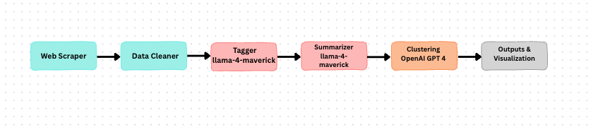

# aarp-health-theme-analyzer


<!-- 1. What the repository about? -> Problem statement + aim + how should it be helpful
2. Setup instruction 1. local 2. docker
3. Project Tree
4. Methodology
5. Results - { Keywords & grouping of Articles } #pending
6. Future of scope - optional -->

## Project Overview

### What This Repository Is About

This repository contains the solution to the **AARP Data Science Internship Assignment (May 2025)**. The goal of the assignment is to build an automated system that can collect, analyze, and organize health-related articles from the [AARP Health Channel](https://www.aarp.org/health/) into meaningful themes using **Large Language Models (LLMs)**.


### Problem Statement


The AARP Health Channel publishes hundreds of articles on a wide range of topics—like nutrition, exercise, aging, chronic illnesses, and public health concerns. While this content is informative, it’s unstructured and scattered across many pages. As the number of articles grows, it becomes harder to manually track what’s being published, identify topic trends, or spot content gaps. Doing this by hand takes time, doesn’t scale well, and can lead to inconsistent results.


### Aim

The aim of this project is to create a **fully automated pipeline** that helps AARP make sense of its health articles in a clear, structured way. The system performs the following steps:

- **Scrapes** articles directly from the AARP Health Channel,
- **Cleans and prepares** the content so it's ready for analysis,
- **Generates clear, concise summaries** for each article using large language models (LLMs),
- **Finds recurring patterns and themes** across the articles using semantic analysis,
- And **groups the articles into theme-based clusters** so that AARP can easily see what kinds of health topics are being discussed the most.


### How This Is Helpful

This system transforms unstructured content into strategic business insights with measurable impact:

- **Editorial teams** can identify content gaps and avoid duplication, enabling them to capture more diverse audience segments and improve search rankings by covering under-represented health topics, ultimately driving higher website traffic and membership growth

**Marketing and product teams** can use these theme clusters to guide their outreach and product positioning. Since the articles reflect broader health trends and public concerns, this enables AARP to:

  - Launch targeted campaigns when people need them most (e.g., heat safety education before summer peaks, flu prevention before winter), allowing them to allocate resources strategically rather than running year-round campaigns,

  - Create targeted educational resources for trending health topics, which attracts new members, increases retention, and generates revenue through insurance sales and corporate partnerships


### Business Impact Example

**Scenario:** The system shows "diabetes management" appears in 40% of articles, meaning many readers are interested in diabetes help.

**Action:** AARP creates diabetes guides, hosts diabetes workshops, and partners with companies to get member discounts on glucose monitors.

**Result:** Members with diabetes get practical help managing their condition, leading to happier members who stay with AARP longer and recommend it to others. This strengthens AARP's reputation as an organization that truly helps seniors with their health challenges.


## Setup Instructions

This section explains how to get the project running, either in a local Python environment or inside a Docker container. Before you begin, make sure you have valid API keys for both OpenAI and Groq, and store them in a `.env` file.

---

### 1. Local Setup

#### Prerequisites
- Python 3.9 or higher  
- [pip](https://pip.pypa.io/en/stable/) (Python package manager)  
- An OpenAI API key and a Groq API key (to be stored in `.env`)  

#### Steps
```bash
# 1. Clone the repository
git clone https://github.com/your-username/aarp-health-theme-cluster.git
cd aarp-health-theme-cluster

# 2. Create and activate a virtual environment
python -m venv env
source env/bin/activate      # On Windows: env\Scripts\activate

# 3. Install dependencies
pip install -r requirements.txt

# 4. Update the .env file with your API keys
#    (a .env file is already present, so open it and add your keys)
#
#    Example .env contents:
#    OPENAI_API_KEY=your_openai_key_here
#    GROQ_API_KEY=your_groq_key_here

# 5. Run the main script to execute the entire pipeline
python main.py
```

> **Note:**  
> - `main.py` orchestrates all modules (scraper, cleaner, summarizer, cluster, etc.) in the correct sequence.  
> - Output files will be generated inside the `results/` directory:  
>   - `cluster_results.json`: shows, for each theme, the list of article links that belong to that cluster.  
>   - `document_keywords.json`: lists the major keywords that each article primarily discusses.
>   - `summaries.json`: summaries for each article    

---

### 2. Docker Setup

#### Prerequisites
- [Docker](https://www.docker.com/get-started) installed on your machine  

#### Steps
```bash
# 1. Clone the repository
git clone https://github.com/your-username/aarp-health-theme-cluster.git
cd aarp-health-theme-cluster

# 2. Update the .env file with your API keys
#    Example .env contents:
#    OPENAI_API_KEY=your_openai_key_here
#    GROQ_API_KEY=your_groq_key_here

# 3. Build the Docker image
docker build -t aarp-health-cluster .

# 4. Run the container, mounting a local 'results/' directory
docker run --env-file .env -v $(pwd)/results:/app/results aarp-health-cluster
```

> **Note:**  
> - The Docker container will read your OpenAI and Groq keys from the `.env` file.  
> - Any output files created inside the container (e.g., `cluster_results.json`, `document_keywords.json`) will be saved to the `results/` folder on your local machine.  
> - `cluster_results.json` shows, for each theme, the list of article links that belong to that cluster.  
> - `document_keywords.json` lists the major keywords that each article primarily discusses.
>   - `summaries.json`: summaries for each article 

---

With these instructions, anyone can set up and run the entire pipeline—either directly in a Python environment or via Docker—ensuring consistent outputs across different machines.


## Project Structure

Below is a high-level view of every file and folder in this repository:

```
├── cleaner.py
├── cluster.py
├── Dockerfile
├── main.py
├── requirements.txt
├── scraper.py
├── summarizer.py
├── tagger.py
├── utils.py
├── results/
│   ├── summaries.json
│   ├── article_to_theme.json
│   ├── cluster_results.json
│   └── document_keywords.json
└── .env
```
Each entry corresponds to a module or output used by the pipeline.  

## Methodology

### Block diagram




*Figure 1: High-level pipeline showing each module and its data flow.*

Below is a detailed, step-by-step description of each stage. We begin with the **Web Scraper**, which crawls the AARP Health Channel to gather every article URL and its full content.

---

### 1. Web Scraper (`scraper.py`)

- **Purpose:** Crawl the AARP Health Channel and collect every article’s URL and full text.

- **How It Works:**

    The web scraper begins at a specified base URL (e.g., `https://www.aarp.org/health`) and uses a recursive function, `extract_article_Links(base_url, max_depth)`, to follow only those links whose path starts with `/health/`, up to a defined depth. By issuing HTTP requests and parsing each page with BeautifulSoup, it builds a set of valid article URLs and writes them to `links.txt`. Next, for each URL in this set (or from the existing `links.txt`), the helper function `get_content_from_link(link, df)` fetches the page, locates the `<div class="articlecontentfragment">` element, concatenates its text, cleans whitespace, and appends the result as `[link, full_text]` to a pandas DataFrame. Finally, the orchestrator function `extract_article_content(base_link)` combines these steps—calling `extract_article_Links`, reading or updating `links.txt`, iterating through each URL with `get_content_from_link`, and saving the completed DataFrame to `results/health_articles.csv` (columns: `Link` and `Content`).

  <!-- 1. **`extract_article_Links(base_url, max_depth)`**  
     - Starts at `base_url` (e.g., `https://www.aarp.org/health`).  
     - Recursively follows only links whose path begins with `/health/`, up to a specified `max_depth`. This `depth` parameter limits how many levels of internal `/health/...` pages are crawled.  
     - Uses `requests.get()` and `BeautifulSoup` to parse each page.  
     - Collects every valid `/health/...` URL into a set and saves them to `links.txt`.

  2. **`get_content_from_link(link, df)`**  
     - Fetches the given article URL.  
     - Looks for `<div class="articlecontentfragment">`.  
     - Extracts and concatenates the text inside that div.  
     - Cleans whitespace and adds one row `[link, full_text]` to a pandas DataFrame.

  3. **`extract_article_content(base_link)`**  
     - Calls `extract_article_Links(base_link, max_depth=3)` (or whatever depth you choose) to build a list of candidate URLs.  
     - Reads from `links.txt` (if present) or uses the returned set.  
     - Iterates over each URL, invoking `get_content_from_link` to gather full text.  
     - Saves the final DataFrame (columns: `Link`, `Content`) to `results/health_articles_depth_3.csv`. -->

### 2. Data Cleaner (`cleaner.py`)

- **Purpose:** Remove incomplete or malformed entries from raw scraped data and normalize text for downstream processing.

- **How It Works:**

    The cleaner module reads the CSV generated by the scraper (`results/health_articles_depth_3.csv`) into a Pandas DataFrame. It filters out any rows where the “Content” field is empty or consists only of whitespace. Finally, it writes the cleaned content back to a new CSV (e.g., `results/health_articles_cleaned.csv`) or prepares an in-memory DataFrame for the next module. This ensures that every article passed to the Summarizer has valid, consistent text.

---

### 3. Data Summarizer (`summarizer.py`)

- **Purpose:** Generate concise, consistent summaries for each cleaned article using a Large Language Model.

- **How It Works:**

    After loading the cleaned articles (from `results/health_articles_cleaned.csv` or the cleaner module’s DataFrame), the summarizer iterates over each row, sending the article’s “Content” to an LLM (LLaMA-4-Maverick instance). For each article, it requests a short (2–3 sentence) summary capturing the core message. The module collects all summaries then writes `results/summaries.json` with the structure:
    
    ```json
    {
    "0": {
        "content": "This article explains the importance of staying hydrated and offers practical tips for older adults to maintain optimal fluid intake.",
        "summary": "This article explains the importance of hydration for older adults and offers practical tips for maintaining adequate fluid intake."
    },
    "1": {
        "content": "In this post, the author discusses early signs of dementia, risk factors, and preventative lifestyle choices to help reduce cognitive decline.",
        "summary": "The author explores early signs of dementia, risk factors, and lifestyle changes that may help prevent cognitive decline."
    }
    }

    ```
            
    By precomputing summaries, the system reduces each article to a few sentences, which in turn minimizes the token overhead during the clustering step. Passing concise summaries to the clustering LLM (often a more powerful, paid API) makes clustering faster, more accurate, and less prone to hallucination, while also lowering the cost and computation compared to feeding full-length articles into the clustering model.


### 4. Clustering & Tagging (`cluster.py` and `tagger.py`)

- **Purpose:** Group articles with similar summaries into coherent themes, assigning each article to a theme that best represents its content.

- **How It Works:**

    First, the clustering module converts the DataFrame of article IDs and summaries into a list of `Article` objects. To keep each LLM prompt within token limits, articles are split into small batches (default size: 5). For each batch, the system constructs a prompt containing two JSON sections: one listing all previously discovered theme names (`existing_themes_json`), and another listing the batch’s articles with their IDs and summaries (`new_articles_json`). The LLM is instructed to first map any new article into an existing theme if it fits, then group multiple articles under a new theme if they share a common topic, and only assign a unique theme if no grouping is possible. This dynamic, priority-based approach ensures stable, consistent themes over time and prevents unnecessary fragmentation.

    The LLM’s response is parsed via a `PydanticOutputParser` into a `ThemeMap` object containing `doc_to_theme` (mapping article IDs to theme names) and `new_theme_names` (any newly coined themes). If the raw output is malformed, an `OutputFixingParser` automatically corrects it. After each batch, the newly assigned themes update the global `article_to_theme` dictionary, and any new theme names are added to the set of known themes, with a progress message indicating how many themes have been discovered so far.

    Finally, once all batches have been processed, a helper function `reformat_results` transforms the flat mapping (article → theme) into a mapping of each theme to its list of article IDs. The result is saved as `results/cluster_results.json` (theme → article URLs). Also, `results/document_keywords.json` is generated to capture top keywords for each article, providing a quick accurately content reflection. By using concise summaries, batching, and dynamic prompts, this approach keeps each LLM call efficient, minimizes token usage, and reduces hallucination risk, while producing clear, human-readable themes for downstream analysis.


### 5. Outputs & Visualization

- **Purpose:** Present clustering results in a structured format and enable quick, interactive insights through visual plots.

- **How It Works:**

    Once clustering is complete, the system writes `results/cluster_results.json` (mapping each theme to its list of article URLs) and `results/document_keywords.json` (listing the top keywords per article). To make these results accessible, they can be loaded into a DataFrame and visualized using libraries like Matplotlib or Seaborn. For example, a bar chart of article counts per theme highlights which topics are most prevalent. These plots allow stakeholders to easily spot dominant themes, identify gaps in coverage effectively.  


 

