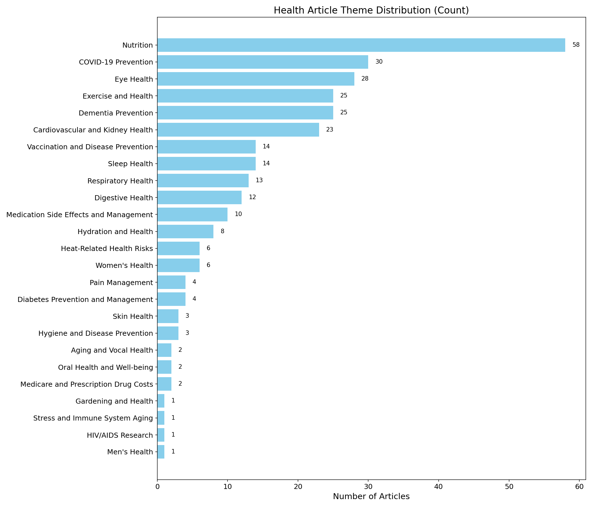
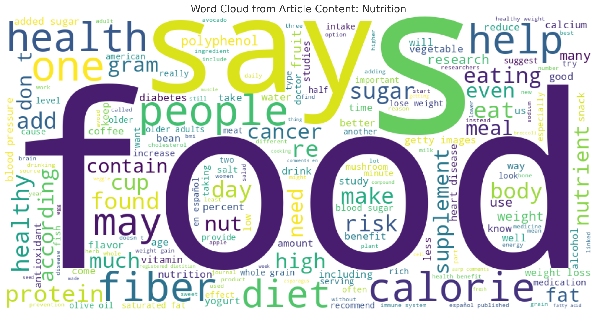
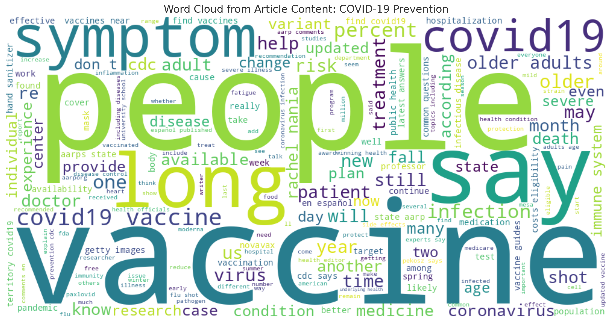
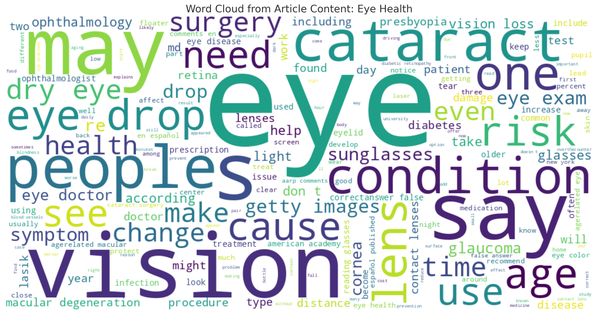

# aarp-health-theme-analyzer


<!-- 1. What the repository about? -> Problem statement + aim + how should it be helpful
2. Setup instruction 1. local 2. docker
3. Project Tree
4. Methodology
5. Results - { Keywords & grouping of Articles } #pending
6. Future of scope - optional -->

## Project Overview

### What This Repository Is About

This repository contains the solution to the **AARP Data Science Internship Assignment (May 2025)**. The goal of the assignment is to build an automated system that can collect, analyze, and organize health-related articles from the [AARP Health Channel](https://www.aarp.org/health/) into meaningful themes using **Large Language Models (LLMs)**.


### Problem Statement


The AARP Health Channel publishes hundreds of articles on a wide range of topics—like nutrition, exercise, aging, chronic illnesses, and public health concerns. While this content is informative, it’s unstructured and scattered across many pages. As the number of articles grows, it becomes harder to manually track what’s being published, identify topic trends, or spot content gaps. Doing this by hand takes time, doesn’t scale well, and can lead to inconsistent results.


### Aim

The aim of this project is to create a **fully automated pipeline** that helps AARP make sense of its health articles in a clear, structured way. The system performs the following steps:

- **Scrapes** articles directly from the AARP Health Channel,
- **Cleans and prepares** the content so it's ready for analysis,
- **Generates clear, concise summaries** for each article using large language models (LLMs),
- **Finds recurring patterns and themes** across the articles using semantic analysis,
- And **groups the articles into theme-based clusters** so that AARP can easily see what kinds of health topics are being discussed the most.


### How This Is Helpful

This system transforms unstructured content into strategic business insights with measurable impact:

- **Editorial teams** can identify content gaps and avoid duplication, enabling them to capture more diverse audience segments and improve search rankings by covering under-represented health topics, ultimately driving higher website traffic and membership growth

**Marketing and product teams** can use these theme clusters to guide their outreach and product positioning. Since the articles reflect broader health trends and public concerns, this enables AARP to:

  - Launch targeted campaigns when people need them most (e.g., heat safety education before summer peaks, flu prevention before winter), allowing them to allocate resources strategically rather than running year-round campaigns,

  - Create targeted educational resources for trending health topics, which attracts new members, increases retention, and generates revenue through insurance sales and corporate partnerships


### Business Impact Example

**Scenario:** The system shows "diabetes management" appears in 40% of articles, meaning many readers are interested in diabetes help.

**Action:** AARP creates diabetes guides, hosts diabetes workshops, and partners with companies to get member discounts on glucose monitors.

**Result:** Members with diabetes get practical help managing their condition, leading to happier members who stay with AARP longer and recommend it to others. This strengthens AARP's reputation as an organization that truly helps seniors with their health challenges.


## Setup Instructions

This section explains how to get the project running, either in a local Python environment or inside a Docker container. Before you begin, make sure you have valid API keys for both OpenAI and Groq, and store them in a `.env` file.

---

### 1. Local Setup

#### Prerequisites
- Python 3.9 or higher  
- [pip](https://pip.pypa.io/en/stable/) (Python package manager)  
- An OpenAI API key and a Groq API key (to be stored in `.env`)  

#### Steps
```bash
# 1. Clone the repository
git clone https://github.com/your-username/aarp-health-theme-cluster.git
cd aarp-health-theme-cluster

# 2. Create and activate a virtual environment
python -m venv env
source env/bin/activate      # On Windows: env\Scripts\activate

# 3. Install dependencies
pip install -r requirements.txt

# 4. Update the .env file with your API keys
#    (a .env file is already present, so open it and add your keys)
#
#    Example .env contents:
#    OPENAI_API_KEY=your_openai_key_here
#    GROQ_API_KEY=your_groq_key_here

# 5. Run the main script to execute the entire pipeline
python main.py
```

> **Note:**  
> - `main.py` orchestrates all modules (scraper, cleaner, summarizer, cluster, etc.) in the correct sequence.  
> - Output files will be generated inside the `results/` directory:  
>   - `cluster_results.json`: shows, for each theme, the list of article links that belong to that cluster.  
>   - `document_keywords.json`: lists the major keywords that each article primarily discusses.
>   - `summaries.json`: summaries for each article    

---

### 2. Docker Setup

#### Prerequisites
- [Docker](https://www.docker.com/get-started) installed on your machine  

#### Steps
```bash
# 1. Clone the repository
git clone https://github.com/your-username/aarp-health-theme-cluster.git
cd aarp-health-theme-cluster

# 2. Update the .env file with your API keys
#    Example .env contents:
#    OPENAI_API_KEY=your_openai_key_here
#    GROQ_API_KEY=your_groq_key_here

# 3. Build the Docker image
docker build -t aarp-health-cluster .

# 4. Run the container, mounting a local 'results/' directory
docker run --env-file .env -v $(pwd)/results:/app/results aarp-health-cluster
```

> **Note:**  
> - The Docker container will read your OpenAI and Groq keys from the `.env` file.  
> - Any output files created inside the container (e.g., `cluster_results.json`, `document_keywords.json`) will be saved to the `results/` folder on your local machine.  
> - `cluster_results.json` shows, for each theme, the list of article links that belong to that cluster.  
> - `document_keywords.json` lists the major keywords that each article primarily discusses.
>   - `summaries.json`: summaries for each article 

---

With these instructions, anyone can set up and run the entire pipeline—either directly in a Python environment or via Docker—ensuring consistent outputs across different machines.


## Project Structure

Below is a high-level view of every file and folder in this repository:

```
├── cleaner.py
├── cluster.py
├── Dockerfile
├── main.py
├── requirements.txt
├── scraper.py
├── summarizer.py
├── tagger.py
├── utils.py
├── results/
│   ├── summaries.json
│   ├── article_to_theme.json
│   ├── cluster_results.json
│   └── document_keywords.json
└── .env
```
Each entry corresponds to a module or output used by the pipeline.  

## Methodology

**Solution Overview:**  
My pipeline first scrapes and cleans all articles, then generates concise summaries for each. I also extract five keywords per article using Meta llama-4 model to provide a quick topic preview—so editors can instantly see each article’s main subjects helping them filter content. Next, I group summaries into small batches and send them to an LLM prompt that includes any existing theme names. The model assigns each article to an existing theme when it fits, creates a new theme if multiple articles share a topic, and only makes a unique theme if absolutely necessary. This approach automatically uncovers new themes (for example, “Long COVID” or “Heat-Related Health Risks”) and keeps labels consistent over time by reusing established themes. In contrast, traditional embedding-and-KNN methods force each article into a fixed set of clusters and cannot adapt to emerging topics or articles that span multiple subjects. By combining rapid keyword previews with batch clustering and dynamic theme naming, my solution delivers both detailed insights at the article level and a clear, data-driven set of high-level themes.


### Block diagram


*Figure 1: High-level pipeline showing each module and its data flow.*

Below is a detailed, step-by-step description of each stage. We begin with the **Web Scraper**, which crawls the AARP Health Channel to gather every article URL and its full content.

---

### 1. Web Scraper (`scraper.py`)

- **Purpose:** Crawl the AARP Health Channel and collect every article’s URL and full text.

- **How It Works:**

    The web scraper begins at a specified base URL (e.g., `https://www.aarp.org/health`) and uses a recursive function, `extract_article_Links(base_url, max_depth)`, to follow only those links whose path starts with `/health/`, up to a defined depth. By issuing HTTP requests and parsing each page with BeautifulSoup, it builds a set of valid article URLs and writes them to `links.txt`. Next, for each URL in this set (or from the existing `links.txt`), the helper function `get_content_from_link(link, df)` fetches the page, locates the `<div class="articlecontentfragment">` element, concatenates its text, cleans whitespace, and appends the result as `[link, full_text]` to a pandas DataFrame. Finally, the orchestrator function `extract_article_content(base_link)` combines these steps—calling `extract_article_Links`, reading or updating `links.txt`, iterating through each URL with `get_content_from_link`, and saving the completed DataFrame to `results/health_articles.csv` (columns: `Link` and `Content`).

---

### 2. Data Cleaner (`cleaner.py`)

- **Purpose:** Remove incomplete or malformed entries from raw scraped data and normalize text for downstream processing.

- **How It Works:**

    The cleaner module reads the CSV generated by the scraper (`results/health_articles_depth_3.csv`) into a Pandas DataFrame. It filters out any rows where the “Content” field is empty or consists only of whitespace. Finally, it writes the cleaned content back to a new CSV (e.g., `results/health_articles_cleaned.csv`) or prepares an in-memory DataFrame for the next module. This ensures that every article passed to the Summarizer has valid, consistent text.

---

### 3. Article Tagger (`tagger.py`)

- **Purpose:** Assign each article a set of five keywords that summarize its main topics, enabling quick article assesment and easy discovery.

- **How It Works:**

    The tagger processes each cleaned article’s full text by sending it to a Groq-powered LLM endpoint. For every article, the `tag()` function composes a chat prompt that instructs the model to behave as a “medical content analyst” and return exactly five keywords separated by commas. It then appends the article’s content as the user message. Groq’s API responds with a comma-separated list of keywords, which the tagger splits and trims to ensure five items per article. As it iterates through the DataFrame, the tagger respects rate limits by pausing briefly between requests and taking longer breaks every 25 articles. The final output is a dictionary mapping each article’s URL to its five keywords, saved as `results/document_keywords.json`. These keywords provide a quick, LLM-powered topic assignment for each article, allowing stakeholders to identify major subjects at a glance without reading full texts.  

---

### 4. Data Summarizer (`summarizer.py`)

- **Purpose:** Generate concise, consistent summaries for each cleaned article using a Large Language Model.

- **How It Works:**

    After loading the cleaned articles (from `results/health_articles_cleaned.csv` or the cleaner module’s DataFrame), the summarizer iterates over each row, sending the article’s “Content” to an LLM (LLaMA-4-Maverick instance). For each article, it requests a short (2–3 sentence) summary capturing the core message. The module collects all summaries then writes `results/summaries.json` with the structure:
    
    ```json
    {
    "0": {
        "content": "This article explains the importance of staying hydrated and offers practical tips for older adults to maintain optimal fluid intake.",
        "summary": "This article explains the importance of hydration for older adults and offers practical tips for maintaining adequate fluid intake."
    },
    "1": {
        "content": "In this post, the author discusses early signs of dementia, risk factors, and preventative lifestyle choices to help reduce cognitive decline.",
        "summary": "The author explores early signs of dementia, risk factors, and lifestyle changes that may help prevent cognitive decline."
    }
    }

    ```
            
    By precomputing summaries, the system reduces each article to a few sentences, which in turn minimizes the token overhead during the clustering step. Passing concise summaries to the clustering LLM (often a more powerful, paid API) makes clustering faster, more accurate, and less prone to hallucination, while also lowering the cost and computation compared to feeding full-length articles into the clustering model.

---

### 5. Clustering & Tagging (`cluster.py` and `tagger.py`)

- **Purpose:** Group articles with similar summaries into coherent themes, assigning each article to a theme that best represents its content.

- **How It Works:**

    First, the clustering module converts the DataFrame of article IDs and summaries into a list of `Article` objects. To keep each LLM prompt within token limits, articles are split into small batches (default size: 5). For each batch, the system constructs a prompt containing two JSON sections: one listing all previously discovered theme names (`existing_themes_json`), and another listing the batch’s articles with their IDs and summaries (`new_articles_json`). The LLM is instructed to first map any new article into an existing theme if it fits, then group multiple articles under a new theme if they share a common topic, and only assign a unique theme if no grouping is possible. This dynamic, priority-based approach ensures stable, consistent themes over time and prevents unnecessary fragmentation.

    The LLM’s response is parsed via a `PydanticOutputParser` into a `ThemeMap` object containing `doc_to_theme` (mapping article IDs to theme names) and `new_theme_names` (any newly coined themes). If the raw output is malformed, an `OutputFixingParser` automatically corrects it. After each batch, the newly assigned themes update the global `article_to_theme` dictionary, and any new theme names are added to the set of known themes, with a progress message indicating how many themes have been discovered so far.

    Finally, once all batches have been processed, a helper function `reformat_results` transforms the flat mapping (article → theme) into a mapping of each theme to its list of article IDs. The result is saved as `results/cluster_results.json` (theme → article URLs). Also, `results/document_keywords.json` is generated to capture top keywords for each article, providing a quick accurately content reflection. By using concise summaries, batching, and dynamic prompts, this approach keeps each LLM call efficient, minimizes token usage, and reduces hallucination risk, while producing clear, human-readable themes for downstream analysis.

---

### 6. Outputs & Visualization

- **Purpose:** Present clustering results in a structured format and enable quick, interactive insights through visual plots.

- **How It Works:**

    Once clustering is complete, the system writes `results/cluster_results.json` (mapping each theme to its list of article URLs) and `results/document_keywords.json` (listing the top keywords per article). To make these results accessible, they can be loaded into a DataFrame and visualized using libraries like Matplotlib or Seaborn. For example, a bar chart of article counts per theme highlights which topics are most prevalent. These plots allow stakeholders to easily spot dominant themes, identify gaps in coverage effectively.  

---


### Results

<!-- The system analyzed 313 scraped health articles from the AARP Health Channel using an automated LLM-driven pipeline. These articles were collected through a recursive web scraper configured to a depth level of 3. This means the crawler followed links up to three levels deep under the /health/ path, which allowed it to collect a broad and diverse set of health-related articles.

You can adjust the depth to crawl more or fewer articles—deeper levels simply uncover more nested links. However, beyond a certain point, increasing the depth adds little new value, as most meaningful content has already been captured. For this prototype, a depth of 3 with ~300 articles was chosen to strike a balance between completeness and manageability.


Article Summaries

Once cleaned, each article was passed to the summarization module, which generated concise summaries using a Meta llama-4-maverick-17b-128e-instruct model. Below are two representative samples:

URL 1: How to Reduce Microplastics [https://www.aarp.org/health/healthy-living/how-to-reduce-microplastics/]

Summary:

The article discusses the pervasive presence of microplastics in our environment, their potential health impacts, and offers practical tips to minimize exposure through everyday choices such as avoiding plastic containers and choosing fresh foods.

URL 2:
Extreme Heat Accelerates Aging [https://www.aarp.org/health/conditions-treatments/extreme-heat-accelerates-aging/]
Summary:

This article explores how prolonged exposure to extreme heat may contribute to accelerated biological aging, particularly in older adults, and highlights the importance of preventive strategies to mitigate heat-related risks.

Theme Clustering

The 313 articles were grouped into theme-based clusters by a language model that analyzed the summaries. Each article was mapped to a consistent theme or prompted the creation of a new one if it addressed a previously unseen topic. Below is a bar chart visualizing the distribution of themes across the dataset:

Add images here

Observations:

As seen in the chart, the most frequently discussed theme was Nutrition, with 58 articles, making it a major focus of the AARP Health Channel. This was followed by COVID-19 Prevention (30 articles) and Eye Health (28 articles), both of which reflect ongoing health concerns, especially among older adults. Other prominent themes included Exercise and Health and Dementia Prevention, each with 25 articles, highlighting AARP’s emphasis on promoting healthy aging and cognitive well-being.

Less frequent but still notable themes included Cardiovascular and Kidney Health, Sleep Health, and Vaccination & Disease Prevention, each receiving moderate representation. Meanwhile, specialized topics such as Skin Health, Diabetes Prevention, and Pain Management appeared in fewer than 5 articles. Finally, rare or emerging topics like Stress and Immune System Aging, HIV/AIDS Research, and Men’s Health were represented by only a single article, suggesting potential gaps or future areas for deeper editorial focus.


Cluster Quality Evaluation
To assess the quality of clustering, we reviewed representative samples from the top three highest-volume themes.

Top 3 Themes (Well-Formed Clusters)
1. Nutrition (58 articles)
Sample articles:

Foods you can eat without gaining weight

Is mushroom coffee healthy?

Nuts and seeds for brain health

These articles are all focused on food, diet, and health, which aligns well with the "Nutrition" theme. The cluster is consistent and meaningful.


Top 3 Themes (Well-Formed Clusters)
1. Nutrition (58 articles)
Sample articles:

Foods you can eat without gaining weight [https://www.aarp.org/health/healthy-living/info-2023/foods-you-can-eat-without-gaining-weight.html]

Is mushroom coffee healthy? [https://www.aarp.org/health/healthy-living/is-mushroom-coffee-healthy/]

Nuts and seeds for brain health [https://www.aarp.org/health/healthy-living/nuts-and-seeds-for-brain-health/]

These articles are all focused on food, diet, and health, which aligns well with the "Nutrition" theme. The cluster is consistent and meaningful.


2. COVID-19 Prevention (30 articles)
Sample articles:

Foods you can eat without gaining weight [https://chatgpt.com/c/683cc2c4-cd2c-8005-9035-3928bcdbf1d4#:~:text=articles)%0ASample%20articles%3A-,One%2Dway%20masking,-COVID%20isolation%20guidelines]

Is mushroom coffee healthy? [https://www.aarp.org/health/conditions-treatments/covid-isolation-guidelines/]

Nuts and seeds for brain health [https://www.aarp.org/health/conditions-treatments/cdc-spring-covid-vaccine/]

This theme contains articles directly related to public health measures and preventive strategies for COVID-19. The grouping is clear and appropriate.

3. Eye Health (28 articles)
Sample articles:

Should you get LASIK surgery? [https://www.aarp.org/health/conditions-treatments/should-you-get-lasik-surgery/]

Common mistakes with eye drops [https://www.aarp.org/health/conditions-treatments/eye-drops-common-mistakes/]

Eye health conditions and treatments [https://www.aarp.org/health/conditions-treatments/eye-health-conditions-symptoms-treatments/]

The cluster correctly includes articles about eye treatments, conditions, and general eye care. The theme is well-defined and cohesive.


Word Clouds for Top Themes
To provide deeper insight into the dominant topics within each cluster, we generated word clouds for the top three themes: Nutrition, COVID-19 Prevention, and Eye Health. Each word cloud was generated by aggregating all content from articles assigned to that theme and highlighting the most frequently occurring words.

Observations & Justification
Word size represents frequency — the larger the word, the more often it appears across articles in that theme.

Words were drawn directly from the cleaned article content.


Nutrition

[image for word cloud of nutrition]

The word cloud clearly emphasizes terms like “food,” “calorie,” “fiber,” “protein,” “meal,” and “diet”, which justifies the cluster’s label. Supporting terms like “supplement,” “nutrient,” and “weight” further reflect discussions around healthy eating, weight loss, and disease prevention—core areas within nutritional content.


COVID-19 Prevention

In this theme, high-frequency words include “vaccine,” “covid19,” “symptom,” “variant,” “infection,” “cdc,” and “immunity.” These terms indicate widespread discussion around vaccination campaigns, public health policy, and the evolving nature of the virus. Words like “patient,” “treatment,” “adults,” and “long” further reflect nuanced concerns like long COVID and access to care for older populations.


Eye Health

This cluster is anchored by dominant terms like “eye,” “vision,” “cataract,” “lens,” “glasses,” “dry,” and “drops.” These reflect a focus on age-related vision issues and treatments. The presence of “surgery,” “exam,” “risk,” “glaucoma,” and “presbyopia” strengthens the clinical and diagnostic context of the theme.


These word clouds help confirm that the themes assigned to each group of articles are accurate by visually highlighting the most frequent and relevant terms found within each cluster. -->


## Results

### Article Collection and Preprocessing

The system analyzed **313 scraped health articles** from the AARP Health Channel using an automated LLM-driven pipeline. These articles were collected through a **recursive web scraper** configured to a **depth level of 3**. This means the crawler followed links up to three levels deep under the `/health/` path, which allowed it to collect a broad and diverse set of health-related articles.

You can adjust the depth to crawl more or fewer articles — deeper levels simply uncover more nested links. However, **beyond a certain point, increasing the depth adds little new value**, as most meaningful content has already been captured. For this prototype, a **depth of 3 with ~300 articles** was chosen to strike a balance between **completeness and manageability**.

---

### Article Summaries

Once cleaned, each article was passed to the summarization module, which generated concise summaries using a **Meta llama-4-maverick-17b-128e-instruct** model. Below are two representative samples:

- **URL 1: [How to Reduce Microplastics](https://www.aarp.org/health/healthy-living/how-to-reduce-microplastics/)**  
  *Summary:* The article discusses the pervasive presence of microplastics in our environment, their potential health impacts, and offers practical tips to minimize exposure through everyday choices such as avoiding plastic containers and choosing fresh foods.

- **URL 2: [Extreme Heat Accelerates Aging](https://www.aarp.org/health/conditions-treatments/extreme-heat-accelerates-aging/)**  
  *Summary:* This article explores how prolonged exposure to extreme heat may contribute to accelerated biological aging, particularly in older adults, and highlights the importance of preventive strategies to mitigate heat-related risks.

---

### Theme Clustering

The 313 articles were grouped into **theme-based clusters** by a language model that analyzed the summaries. Each article was mapped to a consistent theme or prompted the creation of a new one if it addressed a previously unseen topic.

A bar chart was created to visualize the **distribution of themes** across the dataset.



*Figure: Distribution of articles across various health themes. Nutrition dominates, followed by COVID-19 Prevention and Eye Health. Themes with fewer articles may represent underserved content areas.*


---

### Observations

- The most frequently discussed theme was **Nutrition** (58 articles), making it a major focus of the AARP Health Channel.
- This was followed by **COVID-19 Prevention** (30 articles) and **Eye Health** (28 articles), both highly relevant to older adults.
- Other well-represented themes included **Exercise and Health** and **Dementia Prevention** (25 articles each).
- Moderate representation was seen in **Cardiovascular & Kidney Health**, **Sleep Health**, and **Vaccination & Disease Prevention**.
- Less common but noteworthy themes included **Skin Health**, **Diabetes Prevention**, and **Pain Management**.
- Rare or emerging themes such as **Stress and Immune System Aging**, **HIV/AIDS Research**, and **Men’s Health** had only a single article, suggesting areas for future editorial focus.

---

### Cluster Quality Evaluation

To assess quality, we reviewed representative samples from the **top three themes**:

#### 1. Nutrition (58 articles)
- Sample Articles:
  - [Foods you can eat without gaining weight](https://www.aarp.org/health/healthy-living/info-2023/foods-you-can-eat-without-gaining-weight.html)
  - [Is mushroom coffee healthy?](https://www.aarp.org/health/healthy-living/is-mushroom-coffee-healthy/)
  - [Nuts and seeds for brain health](https://www.aarp.org/health/healthy-living/nuts-and-seeds-for-brain-health/)

*Observation:* These articles focus on food, diet, and health, which aligns well with the “Nutrition” theme. The cluster is consistent and meaningful.

#### 2. COVID-19 Prevention (30 articles)
- Sample Articles:
  - [One-way masking](https://www.aarp.org/health/conditions-treatments/one-way-masking/)
  - [COVID isolation guidelines](https://www.aarp.org/health/conditions-treatments/covid-isolation-guidelines/)
  - [CDC spring COVID vaccine](https://www.aarp.org/health/conditions-treatments/cdc-spring-covid-vaccine/)

*Observation:* This theme contains articles focused on preventive strategies, public health measures, and vaccine updates — confirming the appropriateness of the grouping.

#### 3. Eye Health (28 articles)
- Sample Articles:
  - [Should you get LASIK surgery?](https://www.aarp.org/health/conditions-treatments/should-you-get-lasik-surgery/)
  - [Common mistakes with eye drops](https://www.aarp.org/health/conditions-treatments/eye-drops-common-mistakes/)
  - [Eye health conditions and treatments](https://www.aarp.org/health/conditions-treatments/eye-health-conditions-symptoms-treatments/)

*Observation:* These clearly relate to vision, treatments, and diagnosis, making this a strong, coherent theme.

---

### Word Clouds for Top Themes

To provide a deeper understanding of each theme, **word clouds** were generated by aggregating the full article text within each cluster.

#### Nutrition



*Figure: Common terms in articles related to Nutrition. Highlights include “food”, “calorie”, and “diet”, indicating a strong focus on dietary guidance and healthy eating.*

- **Frequent Terms:** food, calorie, fiber, protein, diet, supplement, nutrient
- *Justification:* Reflects discussion around healthy eating, weight loss, and balanced diets.

#### COVID-19 Prevention



*Figure: Word cloud for COVID-19-related articles. Frequent words like “vaccine”, “immunity”, and “variant” confirm the theme’s relevance to pandemic-related preventive care.*


- **Frequent Terms:** vaccine, covid19, symptom, variant, immunity, patient, cdc
- *Justification:* Emphasizes vaccination, long COVID, and public health messaging.

#### Eye Health



*Figure: The Eye Health theme centers around vision concerns like “cataract”, “glasses”, and “glaucoma”, reflecting age-related eye issues discussed in this cluster.*


- **Frequent Terms:** eye, vision, cataract, lens, drops, exam, glaucoma
- *Justification:* Captures age-related eye conditions and clinical terminology accurately.

---

### Why This Matters

These word clouds help confirm that the themes assigned to each group of articles are accurate by visually highlighting the most frequent and relevant terms found within each cluster. Stakeholders can quickly understand what each cluster represents, identify missing subtopics, and use this insight to guide content or campaign strategy more effectively.


 

